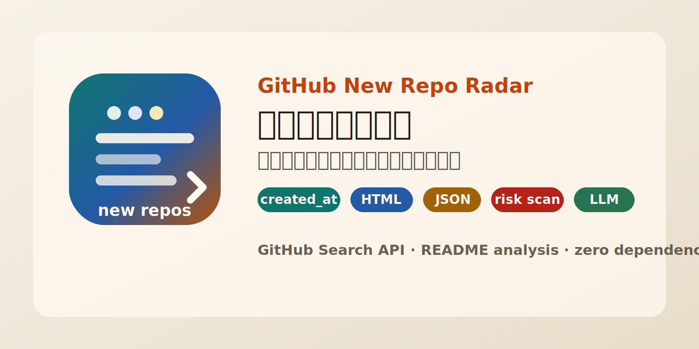

<p align="center">
  
</p>

<p align="center">
  
  
  
  
</p>

# GitHub New Repo Radar

[GitHub New Repo Radar](https://github.com/2300969-star/github-new-repo-radar) 是一个专门查找 **当天新建 GitHub 仓库** 的项目解析 CLI：按 star 降序抓取热门新项目，严格排除旧项目今天更新、今天 push 或今天涨 star 的情况。

它不是简单的 star 榜。它会结合 GitHub 元数据与 README，对每个项目生成定位、机制、证据强弱、风险信号和下一步建议，并输出适合人看的 HTML 页面，也输出适合 LLM / agent 消费的 JSON。

GitHub New Repo Radar finds **newly-created GitHub repositories** for a target local day, sorts them by stars, and turns raw repo metadata into project intelligence: positioning, mechanism, evidence quality, risk signals, and suggested next action.

## 背景

GitHub trending 和搜索结果经常混入旧项目：它们可能只是今天更新、今天 push、今天被传播，但并不是今天创建。这个工具只信 `created_at`。

```text
local date + timezone
   |
   v
UTC created_at window
   |
   v
GitHub Search API: created:YYYY-MM-DD
   |
   v
local exact filter: start <= created_at < end
   |
   v
README + metadata analysis
   |
   v
HTML dashboard / JSON for LLM / Markdown report
```

例如：

```text
--date 2026-07-03 --timezone Asia/Shanghai

2026-07-02T16:00:00Z <= created_at < 2026-07-03T16:00:00Z
```

所以旧项目今天更新、今天 push、今天涨 star，都不会混进来。

## 特性（研究 · 安全）

**研究**

- **严格新项目口径**：只按 `created_at` 过滤目标日期，避免把老项目当成今日新项目。
- **分页抓取带延迟**：支持 `--pages` 与 `--page-delay`，扩大候选范围，同时避免连续请求过猛。
- **项目解析而非标题翻译**：输出项目定位、核心机制、证据强弱、风险判断和下一步建议。
- **多格式输出**：同一次运行可生成 HTML、JSON、Markdown。
- **历史库与索引页**：默认写入 SQLite，并生成 `reports/index.html`，按日期浏览历史报告。
- **趋势与单仓解析**：支持 `trend` 查看历史趋势，支持 `explain owner/repo` 深度解析单个仓库。
- **LLM 友好**：JSON stdout 适合直接传给 Hermes、Codex、Claude Code 或其他 agent。
- **时区明确**：支持 `Asia/Shanghai`、`America/Los_Angeles` 等 IANA 时区。

**安全**

- **高风险下载识别**：检测非 GitHub 下载、`setup.exe`、`trainer.exe`、压缩包密码、管理员运行等信号。
- **凭证/资金边界提示**：识别 API key、OAuth、wallet、payment、trading 等敏感能力。
- **README API 降级**：GitHub README API 被限流时自动 fallback 到 `raw.githubusercontent.com` 常见 README 路径。
- **零运行时依赖**：纯 Python 标准库实现，服务器部署简单。

## 快速开始

前置：本机有 `python3`，版本 `3.10+`。

```bash
git clone https://github.com/2300969-star/github-new-repo-radar.git
cd github-new-repo-radar

python3 -m github_new_repo_radar run \
  --date today \
  --timezone Asia/Shanghai \
  --limit 20 \
  --format all \
  --output-dir ./reports
```

运行后会生成：

```text
reports/github-new-repos-YYYY-MM-DD.html
reports/github-new-repos-YYYY-MM-DD.json
reports/github-new-repos-YYYY-MM-DD.md
reports/github-new-repos-YYYY-MM-DD.csv
reports/github-new-repos-YYYY-MM-DD.summary.md
reports/latest.html
reports/latest.json
reports/latest.md
reports/latest.csv
reports/latest-summary.md
reports/index.html
reports/history.sqlite
```

安装成系统命令：

```bash
python3 -m pip install -e .

github-new-repo-radar run \
  --date today \
  --timezone Asia/Shanghai \
  --limit 20 \
  --format all \
  --output-dir ./reports
```

macOS 本地也可以直接运行：

```bash
./run_today.command
```

查看历史运行记录：

```bash
python3 -m github_new_repo_radar history --db ./reports/history.sqlite
```

检查环境：

```bash
python3 -m github_new_repo_radar doctor --output-dir ./reports
```

## LLM / Agent 调用

机器可读 JSON：

```bash
github-new-repo-radar run \
  --date today \
  --timezone Asia/Shanghai \
  --limit 20 \
  --format json \
  --stdout \
  --output-dir /tmp/github-radar \
  2>/tmp/github-radar-summary.log
```

stdout 是完整 JSON 报告，stderr 只保留运行摘要与 warning。适合让 LLM 继续做二次总结、路由、筛选或通知。

快速抽取前 10 个项目：

```bash
github-new-repo-radar run \
  --date today \
  --timezone Asia/Shanghai \
  --limit 20 \
  --format json \
  --stdout \
  --output-dir /tmp/github-radar \
  | jq '{query, metrics, top: [.items[:10][] | {rank, repo, stars, category, decision, risk_label, summary, action}]}'
```

分页抓取更多候选，并在每页之间等待 2 秒：

```bash
github-new-repo-radar run \
  --date today \
  --timezone Asia/Shanghai \
  --pages 3 \
  --page-delay 2.0 \
  --limit 30 \
  --format all \
  --output-dir ./reports
```

## 输出字段

JSON 中每个项目包含：

```text
repo          owner/name
html_url      GitHub URL
stars         star count at fetch time
category      inferred project category
decision      study / verify / avoid
risk_label    concise risk label
risk_hits     matched risk signals
summary       short project summary
position      what the project is
mechanism     how it appears to work
evidence      metadata and README evidence
risk          risk explanation
action        suggested next step
scores        heat, credibility, depth, utility, novelty, runtime risk
matrix        x/y coordinates for the HTML dashboard
```

`decision` 的含义：

```text
study   值得打开仓库继续研究
verify  有看点，但要先核验源码、权限、安全边界或可行性
avoid   高风险或低可信模式，不建议下载/运行
```

## 历史库与索引页

每次 `run` 默认会写入 SQLite：

```text
reports/history.sqlite
```

并自动生成历史索引：

```text
reports/index.html
```

如果你只想生成一次性文件，不写数据库：

```bash
github-new-repo-radar run \
  --date today \
  --timezone Asia/Shanghai \
  --format all \
  --output-dir ./reports \
  --no-db \
  --no-index
```

查看最近 14 次运行：

```bash
github-new-repo-radar history --db ./reports/history.sqlite --limit 14
```

输出 JSON：

```bash
github-new-repo-radar history --db ./reports/history.sqlite --format json
```

查看趋势：

```bash
github-new-repo-radar trend --db ./reports/history.sqlite --days 14
```

趋势 JSON：

```bash
github-new-repo-radar trend --db ./reports/history.sqlite --days 30 --format json
```

每个日报 HTML 顶部会带日期切换入口：

```text
历史索引 / 上一份 / 下一份 / 最新报告
```

固定入口适合 Nginx、Hermes 或其他系统读取：

```text
reports/latest.html
reports/latest.json
reports/latest.md
reports/latest.csv
```

## 单仓深度解析

解析任意仓库：

```bash
github-new-repo-radar explain owner/repo
```

输出 JSON：

```bash
github-new-repo-radar explain owner/repo --format json
```

写入文件：

```bash
github-new-repo-radar explain owner/repo --output ./reports/explain-owner-repo.md
```

## VPS 定时运行

项目自带 systemd timer，每天 **09:10 Asia/Shanghai** 自动生成报告。

假设项目位于 `/opt/github-new-repo-radar`：

```bash
cd /opt/github-new-repo-radar
sudo scripts/install_systemd_timer.sh
```

手动运行一次：

```bash
sudo systemctl start github-new-repo-radar.service
```

查看定时器：

```bash
systemctl list-timers github-new-repo-radar.timer
```

查看日志：

```bash
journalctl -u github-new-repo-radar.service -n 80 --no-pager
```

默认输出：

```text
/opt/github-new-repo-radar/reports/index.html
/opt/github-new-repo-radar/reports/latest-summary.md
/opt/github-new-repo-radar/reports/history.sqlite
```

## GitHub Token

不配置 token 也能用，但 GitHub 匿名 API 有较低限额。服务器长期调用建议设置：

```bash
export GITHUB_TOKEN="ghp_xxx"
```

或者显式传入：

```bash
github-new-repo-radar run --github-token "$GITHUB_TOKEN"
```

不要把 token 写进仓库、日志或公开报告。

## 常用参数

```text
--date              YYYY-MM-DD 或 today
--timezone          IANA 时区名，例如 Asia/Shanghai、America/Los_Angeles
--limit             输出多少个项目
--pages             每个 UTC 边界日抓取多少页 GitHub Search 结果
--page-delay        每页请求之间等待多少秒，默认 1.5
--min-stars         过滤低于指定 star 的仓库
--format            html、json、md、csv、all
--output-dir        输出目录
--output-name       自定义输出文件名 stem
--readme-limit      读取前多少个项目的 README
--db                SQLite 历史库路径；默认 <output-dir>/history.sqlite
--no-db             不写 SQLite
--no-index          不生成 reports/index.html
--summary-file      指定简明 Markdown 摘要路径
--no-readme         跳过 README，只用元数据快速生成
--stdout            把指定格式同时打印到 stdout
--github-token      GitHub token；默认读取 GITHUB_TOKEN
```

其他命令：

```bash
github-new-repo-radar history --db ./reports/history.sqlite
github-new-repo-radar trend --db ./reports/history.sqlite
github-new-repo-radar explain owner/repo
github-new-repo-radar doctor --output-dir ./reports
```

## 风险评分说明

评分是启发式，不是安全审计结论。命中以下模式会显著提高风险：

- 非 GitHub 下载链接
- `setup.exe`、`trainer.exe`、`tool.exe`
- 压缩包密码
- 管理员运行
- 反检测、注入、内存修改
- 批量私信、用户抓取
- 钱包、交易、API key、OAuth、支付

建议把它当作第一轮筛查器：它帮你挑出值得读的项目，也帮你快速避开不该直接运行的项目。

## 更新计划（Roadmap）

以下为规划方向，不代表时间承诺。欢迎以 issue / PR 参与共建。

**更强的数据源**

- 支持分页抓取更多候选仓库，而不是只取 UTC 边界日的前 100 个。
- 增加 GitHub GraphQL 查询模式，减少 REST API 限流影响。
- 基于 SQLite 历史库增加 star 增长、fork 增长和风险变化趋势图。

**更好的项目解析**

- 将风险规则拆成可配置规则文件。
- 输出更细的项目类型：AI infra、agent skill、browser extension、security-sensitive tool、content index 等。
- 支持把 README 摘要交给外部 LLM，但保留当前零依赖默认路径。

**更方便的部署**

- 提供 Dockerfile。
- 增加 Telegram / 飞书 / 邮件推送适配器。
- 可选生成公网静态站点，按日期浏览历史报告。
